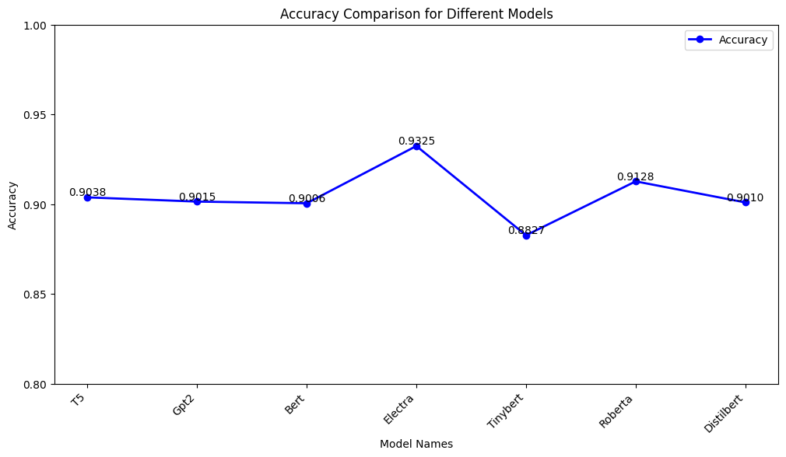
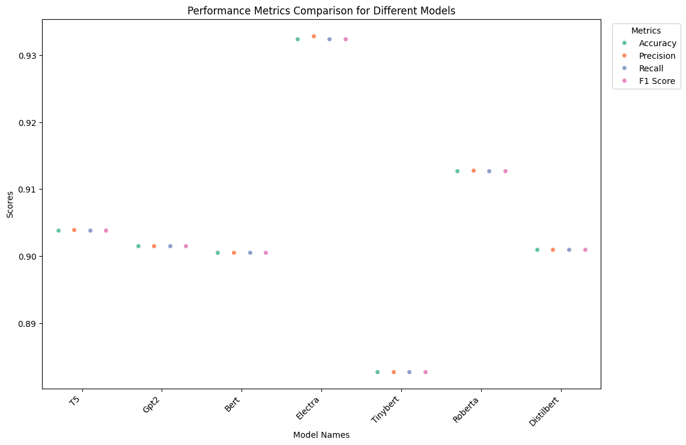

# TextClassification_Sentiment_MovieReviews

# Movie Review Sentiment Classification with Hugging Face Models and its Analysis using Topsis
### Introduction
This project uses 7 text classification models from huggingface to classify movie review into positive and negative classes. It compares their results using different metrics and with the help of Topsis determines the best model amongst them.
For topsis my python package is used for which link is provided [here](https://pypi.org/project/Topsis-Vansh-102103072/1.1.1/)
### Models
The models used are : 
1) DistilBert ([distilbert-base-uncased-finetuned-sst-2-english](https://huggingface.co/distilbert-base-uncased-finetuned-sst-2-english))
2) GPT2 -medium ([michelecafagna26/gpt2-medium-finetuned-sst2-sentiment](https://huggingface.co/michelecafagna26/gpt2-medium-finetuned-sst2-sentiment))
3) Bert -base ([echarlaix/bert-base-uncased-sst2-acc91.1-d37-hybrid](https://huggingface.co/echarlaix/bert-base-uncased-sst2-acc91.1-d37-hybrid))
4) Electra -small ([Hazqeel/electra-small-finetuned-sst2-rotten_tomatoes-distilled](https://huggingface.co/Hazqeel/electra-small-finetuned-sst2-rotten_tomatoes-distilled))
5) TinyBert ([Vishnou/TinyBERT_SST2](https://huggingface.co/Vishnou/TinyBERT_SST2))
6) RoBERTa -base([rasyosef/roberta-base-finetuned-sst2](https://huggingface.co/rasyosef/roberta-base-finetuned-sst2))
7) T5 ([michelecafagna26/t5-base-finetuned-sst2-sentiment](https://huggingface.co/michelecafagna26/t5-base-finetuned-sst2-sentiment))

These all models are pre trained on SST-2 dataset which is a dataset of sentences from moview reviews
Link to SST-2 Dataset: [SST-2](https://huggingface.co/datasets/sst2/viewer/default/train)

The Electra model is also trained on [Rotten Tomatoes](https://huggingface.co/datasets/rotten_tomatoes) dataset from huggingface which has its impact on the final results.

## Testing
For testing of these models Rotten Tomatoes movie reviews dataset is used which can be found on Kaggle as well as Huggingface
To increase the testing dataset the test and validation splits are concatenated and then used for testing.
Link to Kaggle: [Kaggle](https://www.kaggle.com/datasets/thedevastator/movie-review-data-set-from-rotten-tomatoes)
For each model accuracy , precision , recall , f1 score and MCC score (Matthews Correlation Coefficient) is calculated.Also confusion matrix for each model is also displayed as a heatmap

## Results
Output Table displaying metrics of each model
| Model      | Accuracy       | Precision      | Recall         | F1 Score       | MCC            |
|------------|----------------|----------------|----------------|----------------|----------------|
| T5         | 0.903846154    | 0.903926132    | 0.903846154    | 0.903841394    | 0.807772282    |
| Gpt2       | 0.901500938    | 0.901513658    | 0.901500938    | 0.901500158    | 0.803014596    |
| Bert       | 0.900562852    | 0.900564262    | 0.900562852    | 0.900562764    | 0.801127114    |
| Electra    | 0.932457786    | 0.932898168    | 0.932457786    | 0.932440604    | 0.865355842    |
| Tinybert   | 0.882739212    | 0.882751338    | 0.882739212    | 0.882738283    | 0.76549055     |
| Roberta    | 0.912757974    | 0.912781222    | 0.912757974    | 0.912756745    | 0.825539195    |
| Distilbert | 0.901031895    | 0.901035071    | 0.901031895    | 0.901031699    | 0.802066966    |

## Topsis Result
For topsis, installed my package from pypi using 
```sh
pip install Topsis-Vansh-102103072==1.1.1
```
### Topsis Table with ranks and topsis score
| Model      | Accuracy       | Precision      | Recall         | F1 Score       | MCC            | Topsis Score   | Rank           |
|------------|----------------|----------------|----------------|----------------|----------------|----------------|----------------|
| T5         | 0.903846154    | 0.903926132    | 0.903846154    | 0.903841394    | 0.807772282    | 0.423714236    | 3              |
| Gpt2       | 0.901500938    | 0.901513658    | 0.901500938    | 0.901500158    | 0.803014596    | 0.37621739     | 4              |
| Bert       | 0.900562852    | 0.900564262    | 0.900562852    | 0.900562764    | 0.801127114    | 0.357327914    | 6              |
| Electra    | 0.932457786    | 0.932898168    | 0.932457786    | 0.932440604    | 0.865355842    | 1              | 1              |
| Tinybert   | 0.882739212    | 0.882751338    | 0.882739212    | 0.882738283    | 0.76549055     | 0              | 7              |
| Roberta    | 0.912757974    | 0.912781222    | 0.912757974    | 0.912756745    | 0.825539195    | 0.602016133    | 2              |
| Distilbert | 0.901031895    | 0.901035071    | 0.901031895    | 0.901031699    | 0.802066966    | 0.366745497    | 5   

## Graphs 
Line Plot of Accuracy

Strip Plot of Accuracy , Precision ,Recall ,F1 Score

Bar Graph of Matthews Correlation Coefficient

Horizontal Bar Graph of Topsis Score along with rank


## Confusion Matrix 
| T5 Model | GPT-2 Model |
|---|---|
|  |  |

| BERT Model | ELECTRA Model |
|---|---|
|  |  |

| Roberta Model | TinyBERT Model |
|---|---|
|  |  

<p align="center">
DistilBert Model 
</p>
<p align="center">
|
</p>

## Conclusion 
Electra small model by google which is fine tuned on SST 2 and rotten tomatoes dataset outperformed the other models with the highest metrics and rank 1 and with a perfect 1.0 topsis score. 
Its good impact can be infered due to a large training data of movie reviews. 


 
